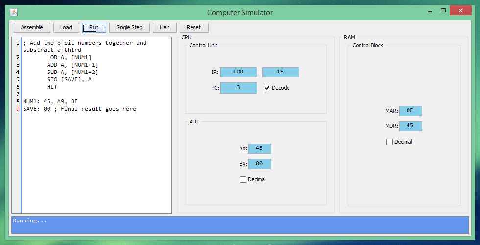

# Computer simulator

This is the simple *computer system simulator* which started as a course project at Peter the Great St.Petersburg Polytechnic University.

---

### User interface



### Instructions Table

Here's a set of possible mnemonics for the machine codes that the computer recognizes:

| Operation            | Code     | Mnemonic   |
|----------------------|----------|------------|
| Load                 | `0b0001` | `LOD`      |
| Store                | `0b1000` | `STO`      |
| Add                  | `0b0010` | `ADD`      |
| Subtract             | `0b0011` | `SUB`      |
| Add with Carry       | `0b0100` | `ADC`      |
| Subtract with Borrow | `0b0101` | `SBB`      |
| Jump                 | `0b0110` | `JMP`      |
| Jump If Zero         | `0b1010` | `JZ `      |
| Jump If Not Zero     | `0b1001` | `JNZ`      |
| Halt                 | `0b0111` | `HLT`      |

### Examples

There are examples of programs for the simulator below:</p>
###### First example:

```text
;  Multiply 8-bit values 0xA7 and 0x1C
BEGIN:  LOD A, [RESULT+1] ; Load  byte at address RESULT+1 into accumulator
        ADD A, [NUM1+1]   ; Add byte at address NUM1+1 to accumulator
        STO [RESULT+1], A ; Store contents of accumulator at address RESULT+1

        LOD A, [RESULT]   ; Load  byte at address RESULT into accumulator
        ADC A, [NUM1]     ; Add with carry byte at address NUM1 to accumulator
        STO [RESULT], A   ; Store contents of accumulator at address RESULT

        LOD A, [NUM2+1]   ; Load  byte at address NUM2+1 into accumulator
        ADD A, [DEC]      ; Add byte at address DEC to accumulator
        STO [NUM2+1], A   ; Store contents of accumulator at address NUM2+1

        JNZ BEGIN         ; Jump if not zero to the instruction at BEGIN
        HLT               ; Halt
        
DEC:    FF                ; On the 28 (0x1C) time through value 1 will be added
                          ;  to 0xFF and the result will be zero, so
                          ;  the JNZ instruction will not jump back to BEGIN
                          ;  Instead, the next instruction is a Halt.

NUM1:   00, A7
NUM2:   00, 1C
RESULT: 00, 00            ; 16-bit value goes here
```

###### Second example

```text
; Add two 8-bit numbers together and subtract a third
       LOD A, [NUM1]
       ADD A, [NUM1+1]
       SUB A, [NUM1+2]
       STO [SAVE], A
       HLT

NUM1: 45, A9, 8E
SAVE: 00 ; Final result goes here
```

NOTE: don't try to place labels before or between instructions: it doesn't work temporarily. Type labels only after all commands.
